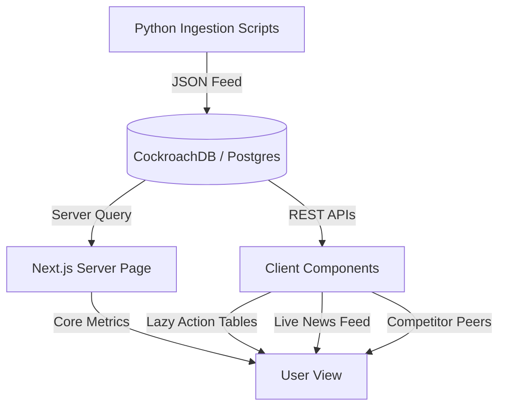

# Singest 📈

**Singest** is a premium, high-performance web dashboard and screening application tailored for tracking Indian equities (NSE & BSE). Built with Next.js 15, React 19, and CockroachDB, it combines real-time data filtering with an asynchronous news and corporate action timeline.

---

## ⚡ Key Capabilities

- **🏠 Real-time Market Overview:** Live tracking of top gainers, top losers, and market capitalizations.
- **🔍 Interactive Dual-State Screener:** Filter stocks instantly by P/E bounds, ROCE, ROE, Dividend Yield, and Market Cap class. Uses stateful filters to minimize server-side database load.
- **📊 Dynamic Stock Profile:** Individual pages showing 5-year price performance charts, technical moving averages (SMA 50, SMA 200, Bollinger Width, ATR), trigonometric SVG RSI gauges, peer comparison tables, and corporate actions.
- **⚙️ Background Ingest Pipeline:** Dedicated Python scripts that pull corporate actions, news sentiment, and scans from external Dhan APIs and dynamically upsert them.

---

## 🏗️ Architecture & Data Flow



---

## 📁 Repository Directory Structure

```bash
├── Backend/                 # Python ingestion pipeline
│   ├── scripts/             # Data fetchers (corporate actions, news, scans)
│   ├── main.py              # Subprocess pipeline orchestrator
│   └── requirements.txt     # Python dependencies
│
└── src/                     # Next.js web application
    ├── app/                 # Next.js App Router
    │   ├── api/             # REST endpoints (corporateActions, customScans, liveNews)
    │   ├── screener/        # Stock Screener page
    │   └── stock/[isin]/    # Component-isolated dynamic profile page
    │
    ├── lib/                 # Shared utilities, DB pool singletons, and theme toggler
    └── styles.css           # Styling configuration (Tailwind CSS v4 & theme variables)
```

---

## 🚀 Getting Started

### 📋 Prerequisites

- Node.js 18.x or later
- Python 3.10 or later
- A running PostgreSQL or CockroachDB instance

### 1. Configure the Environment

Create a `.env` file in the project root folder:

```env
# Database connection string
DATABASE_URL="postgresql://<username>:<password>@<host>:<port>/<database>?sslmode=require"

# Number of days to look ahead for corporate actions (default: 90)
CORP_ACT_LOOKAHEAD_DAYS=90
```

### 2. Setup the Web Application

```bash
# Install dependencies
npm install

# Run the dev server
npm run dev
```

Open [http://localhost:3000](http://localhost:3000) to view the application.

### 3. Setup the Data Ingestion Pipeline

```bash
cd Backend

# Install dependencies
pip install -r requirements.txt

# Run ingestion script
python main.py
```

---

## 🛠️ Optimization & Reliability

### 🛡️ Component Isolation & Fallbacks

Every major block on the stock profile page is wrapped in an independent **React Error Boundary** (`SectionErrorBoundary`). If a component fails to render or an API query times out, only that block displays an "Under Maintenance" state while the rest of the page remains fully interactive.

### 🚀 Performance Optimization

- **Server Component Pre-rendering:** The initial stock profile layout and CMP metrics are pre-fetched on the server for instant FCP (First Contentful Paint) and SEO.
- **Consolidated API Queries:** All dynamic data fetching routes are grouped logically (`corporateActions`, `customScans`, and `liveNews`), avoiding duplicate database queries.
